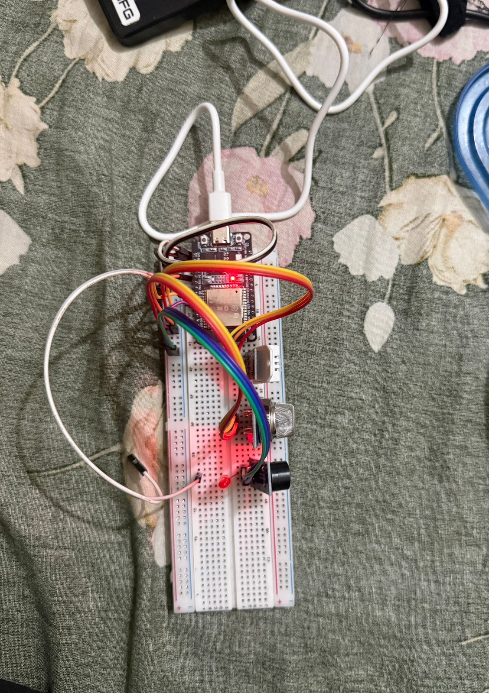
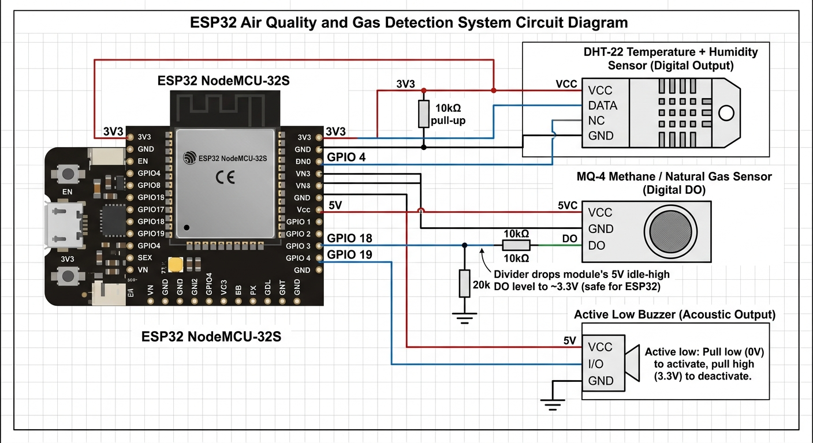

# Simple ESP32-Based Home Monitoring

A self-contained temperature, humidity and gas monitor built on an ESP32. The
board hosts its own WiFi access point and serves a live dashboard, so any phone
or laptop can see the current state without a router, an app, or an internet
connection. An on-board buzzer sounds an over-temperature alarm.

Built with PlatformIO and the Arduino framework for the ESP32.

---

## Demo



<p align="center"><em>The assembled prototype — ESP32, DHT-22, MQ-4 and buzzer.</em></p>

<!--
  MORE IMAGES: drop the file into images/ and add a line here, for example
      
  The path is relative to this file, so it is just images/<filename>.
  Do NOT use a https://github.com/.../blob/... URL - that is a web page, not
  the image, and it renders as a broken icon.
-->

### Video walkthrough

[**▶ Watch the demo video**](images/projectDemonastartion.mp4)

A short walkthrough of the working prototype. GitHub opens it in its own file
viewer and plays it there.

<!--
  The link above is a click-through, which is all GitHub allows for a video
  committed to the repository - Markdown has no video syntax, and the <video>
  tag is stripped from READMEs.

  To get a player embedded directly in this page instead: open a new issue in
  this repo, drag the .mp4 into the comment box, wait for the upload to finish,
  then copy the generated https://github.com/user-attachments/assets/... URL
  and paste it here as a bare URL on its own line. You can close the issue
  afterwards; the video stays hosted.
-->

---

## Features

- **Live web dashboard** served straight from the ESP32's flash — no SPIFFS
  image, no external hosting. Auto-refreshes every 2 s.
- **Standalone access point.** The board creates its own WiFi network, so the
  project works anywhere with no router or internet.
- **Combined safety verdict.** Both sensors are reduced to a single
  SAFE / CAUTION / UNSAFE banner rather than leaving the reader to interpret
  raw numbers.
- **Audible over-temperature alarm** with an intermittent beep pattern.
- **Fails loud, not silent.** A sensor that is warming up, disconnected or
  returning garbage reports `CHECKING` — never a falsely reassuring "safe".
- **Fully non-blocking.** No `delay()` anywhere in the main loop, so the web
  server stays responsive while every sensor runs on its own timer.

---

## Hardware

| Component | Notes |
| --- | --- |
| ESP32 dev board | NodeMCU-32S (ESP32-WROOM-32) |
| DHT-22 (AM2302) | Temperature and humidity |
| MQ-4 gas sensor module | Methane / natural gas, read via its digital output |
| Active buzzer module | Active-low trigger |
| 10 kΩ resistor | Pull-up for the DHT-22 data line |
| 10 kΩ + 20 kΩ resistors | Divider on the MQ-4 DO line (see below) |
| Breadboard and jumper wires | |

### Wiring

| Module | Pin | ESP32 | Notes |
| --- | --- | --- | --- |
| **DHT-22** | VCC | 3V3 | |
| | DATA | **GPIO 4** | 10 kΩ pull-up to 3V3 |
| | GND | GND | |
| **MQ-4** | VCC | 5V | The heater needs 5 V |
| | DO | **GPIO 18** | Through a level divider — see the warning below |
| | GND | GND | |
| **Buzzer** | VCC | 5V | |
| | I/O | **GPIO 19** | Active low |
| | GND | GND | |

### Circuit diagram



<details>
<summary>Text version of the same circuit</summary>

```
                        ESP32 NodeMCU-32S
                     +-----------------------+
                     |                       |
                     |  3V3             5V   |
                     |  GND             GND  |
                     |  GPIO 4               |
                     |  GPIO 18              |
                     |  GPIO 19              |
                     +-----------------------+


  DHT-22  --  temperature + humidity
  ------------------------------------------------------------------
                                +--------------------o  VCC
                                |
       3V3  o-------------------+
                                |
                               | | 10k pull-up
                               |_|
                                |
    GPIO 4  o-------------------+--------------------o  DATA

       GND  o----------------------------------------o  GND


  MQ-4  --  methane / natural gas, digital output
  ------------------------------------------------------------------
        5V  o----------------------------------------o  VCC

       GND  o----------------------------------------o  GND

                                            10k
   GPIO 18  o------------------+--------/\/\/\------o  DO
                               |
                              | | 20k
                              |_|
                               |
       GND  o------------------+

             The divider drops the module's 5 V idle-high DO
             level to ~3.3 V.  ESP32 pins are not 5 V tolerant.


  Buzzer  --  active low
  ------------------------------------------------------------------
        5V  o----------------------------------------o  VCC

   GPIO 19  o----------------------------------------o  I/O

       GND  o----------------------------------------o  GND
```

</details>

> [!WARNING]
> **The MQ-4's DO line needs a voltage divider.** Most MQ breakouts pull DO up
> to VCC, so with the module powered at 5 V the idle-high level is 5 V — and
> ESP32 pins are **not** 5 V tolerant. Use 10 kΩ from DO to the GPIO and 20 kΩ
> from the GPIO to GND (≈3.3 V), or confirm with a multimeter that your
> board's DO idles at 3.3 V before connecting it directly.

---

## Why these pins

Two constraints drove the pin assignment, and both are easy to get wrong:

**The MQ-4 uses its digital output, not the analog one.** The ESP32 has two ADC
blocks, and the WiFi radio takes ownership of **ADC2** when the access point
starts. Any `analogRead()` on an ADC2 pin (GPIO 0, 2, 4, 12–15, 25–27) returns
0 once the dashboard is up — which, after the warm-up gate lifts, would display
as a confident *SAFE* forever. Only **ADC1** (GPIO 32–39) survives WiFi, and
those pins are not broken out on this build, so the design reads the module's
comparator output instead. The trade-off is a single threshold crossing rather
than a graded reading; sensitivity is set by the trim pot on the module.

**The buzzer avoids strapping pins.** GPIO 2, 5 and 15 are sampled at reset to
decide boot mode. A buzzer line held at the wrong level while the ESP32 starts
can stop it booting, so the buzzer sits on GPIO 19.

---

## Getting started

### Prerequisites

- [PlatformIO](https://platformio.org/) (the VS Code extension, or the CLI)
- A USB cable and an ESP32 board

### Build and flash

```bash
git clone https://github.com/mdJesan-08/SimpleEspBasedHomeMonitoring.git
cd SimpleEspBasedHomeMonitoring

pio run              # compile
pio run -t upload    # flash the board
pio device monitor   # watch the serial output at 115200 baud
```

Dependencies are declared in `platformio.ini` and are fetched automatically on
the first build.

### Open the dashboard

1. Power the board.
2. On a phone or laptop, join the WiFi network **`homeAutomation`**.
3. Open **<http://192.168.4.1>** in a browser.

The SSID and password are set in [`include/config.h`](include/config.h).

---

## Configuration

Every board-specific value lives in [`include/config.h`](include/config.h), so
the libraries stay reusable and nothing needs editing anywhere else.

| Setting | Default | Purpose |
| --- | --- | --- |
| `DHT_DATA_PIN` | 4 | DHT-22 data line |
| `MQ4_DIGITAL_PIN` | 18 | MQ-4 comparator output |
| `MQ4_DO_ACTIVE_LOW` | 1 | Set to 0 if your module drives DO high on detection |
| `MQ4_WARMUP_MS` | 30000 | Heater warm-up before any verdict is given |
| `MQ4_CLEAR_SAMPLES` | 3 | Quiet samples needed to clear the gas alarm |
| `BUZZER_PIN` | 19 | Buzzer signal line |
| `BUZZER_ACTIVE_LOW` | 1 | Set to 0 for an active-high buzzer |
| `BUZZER_SELFTEST_MS` | 300 | Boot self-test beep; set to 0 to disable |
| `BUZZER_TEMP_ON_C` | 31.5 | Start beeping at or above this temperature |
| `BUZZER_TEMP_OFF_C` | 31.0 | Stop beeping at or below this temperature |
| `WIFI_AP_SSID` | `homeAutomation` | Access point name |
| `WEB_POLL_INTERVAL_MS` | 2000 | How often the browser fetches a new reading |

---

## Calibration

**Gas sensor.** There is no threshold in software — the trip point is the trim
pot on the MQ-4 module. Power the board and let the sensor warm up, then in
clean air turn the pot until the module's own indicator LED just switches off
(serial shows `SAFE`). Back it off slightly, then confirm with a brief puff
from an **unlit** lighter that it trips to `GAS DETECTED` and recovers.

> [!NOTE]
> A brand-new MQ-4 wants 24 h or more of burn-in before its readings settle.
> The 30 s warm-up in firmware is the per-power-up figure, not a substitute.

**Temperature alarm.** Adjust `BUZZER_TEMP_ON_C` and `BUZZER_TEMP_OFF_C`. Keep
a gap between them — that gap is hysteresis, and without it a reading sitting
exactly on the threshold switches the buzzer on and off every couple of
seconds.

---

## How it works

Each sensor is a self-contained, non-blocking library under `lib/`. They own
their own timing, so `loop()` never calls `delay()` and the web server stays
responsive.

```
src/main.cpp          Wiring: owns the sensor objects and the main loop
include/config.h      Every pin, threshold and credential
lib/DhtSensor/        Rate-limited wrapper around the Adafruit DHT driver
lib/GasSensor/        MQ-4 digital output, warm-up gate and debounce
lib/Buzzer/           Non-blocking intermittent beep pattern
lib/WebUi/            Access point, HTTP server, JSON API and the verdict logic
lib/WebUi/web/        Dashboard source; generate_page.py embeds it into flash
```

### Design decisions worth knowing

- **Warm-up gate.** A cold MQ-4 reads low, which would otherwise display as a
  confident *SAFE*. The sensor reports `WARMING UP` and marks the reading
  invalid until the heater has had 30 s.
- **Asymmetric debounce.** The gas alarm trips on the first detection but needs
  three consecutive quiet samples to stand down. A comparator sitting near its
  threshold chatters, and an alarm that flickers off is worse than one that
  lingers.
- **The verdict never guesses.** If either sensor is warming up or unreadable
  the dashboard shows `CHECKING`, not `SAFE`. An unread sensor must never be
  reported as all-clear.
- **The buzzer fails loud.** If a DHT-22 read fails while the alarm is
  sounding, the alarm holds. A failed read is not evidence the room cooled
  down.
- **Boot silence.** The buzzer pin is set to its off level *before* being
  switched to an output, so a floating pin cannot sound the buzzer at power-up.

### Editing the dashboard

The UI lives in `lib/WebUi/web/index.html` and is compiled into flash as a
PROGMEM string. After editing it, regenerate the header:

```bash
python3 lib/WebUi/web/generate_page.py
```

---

## Serial output

```
Home automation node: DHT-22 + MQ-4
Buzzer self-test - you should hear one beep now
MQ-4 warming up for 30 s - no verdict until then
WiFi access point: homeAutomation
Open http://192.168.4.1
Temperature: 29.4 C (84.9 F)  Humidity: 61.0 %  Heat index: 31.2 C
Gas (MQ-4): WARMING UP
Temperature: 31.7 C (89.1 F)  Humidity: 60.4 %  Heat index: 34.8 C
Buzzer ON (31.7 C, on at 31.5 / off at 31.0)
Gas (MQ-4): SAFE
```

---

## Troubleshooting

| Symptom | Likely cause |
| --- | --- |
| `DHT-22: read failed` | Missing 10 kΩ pull-up, or wrong pin |
| Gas reads `GAS DETECTED` in clean air | Trim pot set too sensitive, or `MQ4_DO_ACTIVE_LOW` inverted |
| Gas never trips | Same flag inverted the other way; verify against the module's LED |
| No boot self-test beep | Buzzer pin, power, or `BUZZER_ACTIVE_LOW` — test by touching the signal wire to GND |
| Buzzer sounds constantly from boot | `BUZZER_ACTIVE_LOW` is inverted |
| Dashboard will not load | Confirm you joined the board's own SSID, then use `http://` (not `https://`) |

---

## Author

**MD. Jesan** — EEE 383
